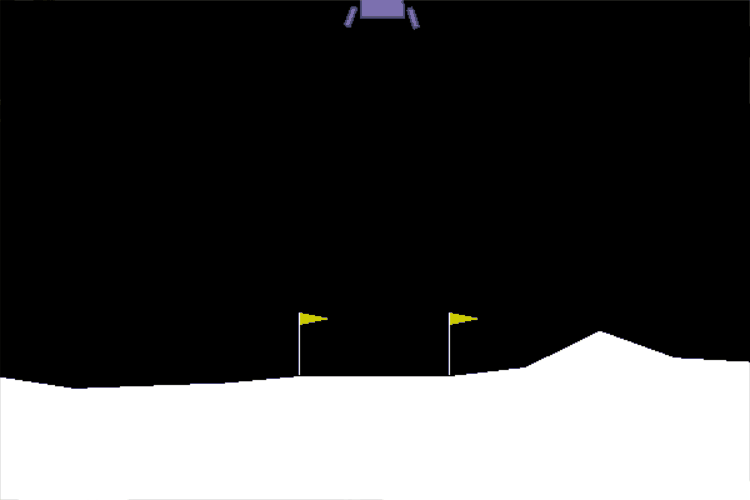

This repository contains many Reinforcement Learning algorithms that I've implemented over the years out of curiosity. Naturally, the algorithms are not designed to be used by other people. However, some more recent implementations are more user-friendly, such as the algorithms implemented in the **A2C** folder.

# Advantage Actor Critic - Single Threaded
Implementation of the Actor-Critic Algorithm using Advantage Estimation to reduce the variance of the policy gradient. This implementation also includes Entropy Regularization to improve exploration.

Code can be found in **./A2C/simpleActorCritic.py**

## LunarLander

## PyBullet Hopper
